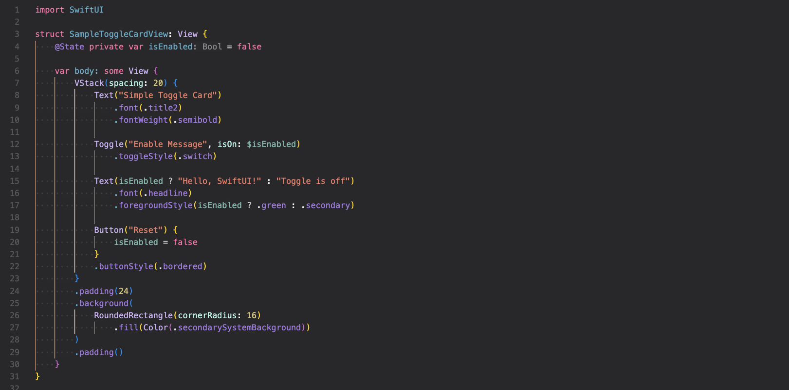

# Xcode Color

[EN](./README.md) / [JP](./README-JP.md)

Provides an Xcode-style color theme for Visual Studio Code/Cursor, along with Swift color mappings.

### [1.0.1] -- 2026.3.24

Changed the supported VS Code version from 1.110.0 to 1.80.0.

### [1.0.0] -- 2026-3-23

Released the initial version.
